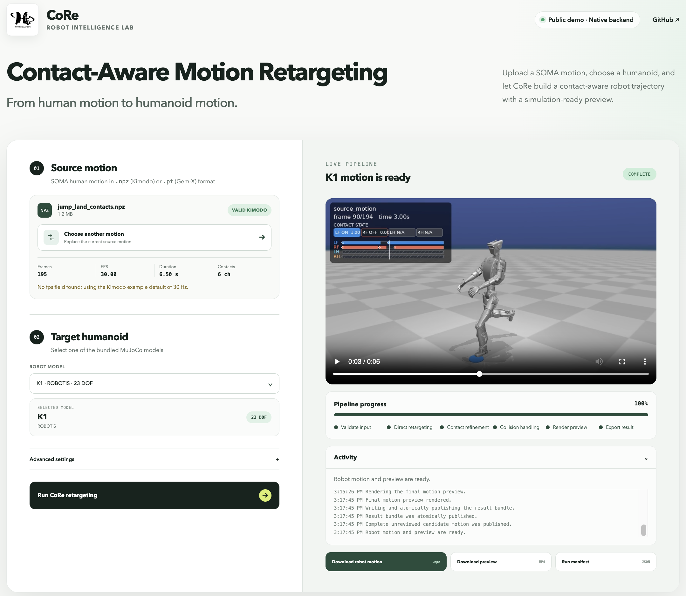

# RIMKit

<p align="center">
  <a href="https://github.com/tmjeong1103/RIMKit/actions/workflows/ci.yml"></a>
  <a href="https://huggingface.co/spaces/robotaemoon/CoRe"></a>
  <a href="https://doi.org/10.1109/Humanoids65713.2025.11203055"></a>
  <a href="https://doi.org/10.1109/IROS60139.2025.11246607"></a>
  <a href="LICENSE"></a>
</p>

<p align="center">
  
</p>

RIMKit（Robot Intelligence Lab Motion Kit）将
[SOMA](https://github.com/NVlabs/SOMA-X) 人体动作转换为人形机器人的全身动作。
当前版本提供用于接触感知重定向的
[**CoRe**](https://tmjeong1103.github.io/CoRe/) 方法，并通过统一的 Python 和命令行
界面支持来自 Unitree Robotics、ROBOTIS、Apptronik、LimX Dynamics、Fourier Intelligence、
PNDbotics、Booster Robotics、ENGINEAI、Menlo Research、AgiBot 和 Noetix Robotics 的十七种目标机器人；
开箱即用地导出机器人动作 `.npz` 文件和视频。

源动作可以是 [Kimodo](https://github.com/nv-tlabs/kimodo) `.npz` 文件，或
[GEM-X](https://github.com/NVlabs/GEM-X) `.pt` 文件。RIMKit 根据扩展名选择源适配器，
并在重定向前将两种格式规范化为相同的 SOMA77 阶段数据约定。

RIMKit 使用 [MuJoCo 模拟器](https://mujoco.org/)加载机器人模型、评估碰撞距离，
并渲染动作预览。

## 可用方法

| ID | 方法 | 说明 |
|---|---|---|
| `core` | CoRe | 面向人形机器人的接触感知全身动作重定向 |

使用 `rimkit methods list` 列出已安装版本提供的方法。

该流程建立在
[稳健的机器人动作重定向](https://tmjeong1103.github.io/RMR/)
和
[接触感知动作细化](https://tmjeong1103.github.io/CoRe/) 的基础上。

## 特性

- 带有碰撞细化和接地处理的接触感知全身动作重定向
- 一条流程支持十七个内置人形机器人模型
- 只需一个 `--robot` 参数即可切换机器人
- 编译式 C++ MuJoCo 内核，以及可移植的 Python 后备实现
- 浏览器、命令行和 Python 接口
- Kimodo `.npz` 与 GEM-X `.pt` 源动作适配器
- 十六个可直接运行的源动作：八个 Kimodo `.npz` 和八个 GEM-X `.pt`
- 在全部十七个机器人上可复现地批量生成 Kimodo 和 GEM-X 结果

## 在线演示

无需安装即可试用 RIMKit。可一键运行内置的 Kimodo `foot_walk_stop.npz` 或
GEM-X `scurry_walk.pt` 示例，也可以上传自己的 `.npz`/`.pt` SOMA 动作。
浏览器界面可在全部十七个内置人形机器人上运行 RIMKit 的 CoRe 方法、预览最终动作，
并提供可安全加载的机器人动作 `.npz` 文件及清单供下载。

[**在 Hugging Face 上启动在线演示 →**](https://huggingface.co/spaces/robotaemoon/CoRe)

<p>
  <a href="https://huggingface.co/spaces/robotaemoon/CoRe">
    
  </a>
</p>

如需在自己的机器上运行相同的界面，请参阅
[本地网页演示](#本地网页演示)。它会先创建隔离的 Python 环境，再安装网页依赖并启动服务器。

## 结果视频

当前发布的图库按制造商分组，展示了十六个已发布人形机器人的两种代表性源动作：
**G1, H1, H2, R1, K1, Apollo, Oli, N1, GR3, ADAM Lite, T1, T2, PM01,
Asimov-1, X2-Ultra, A3 T3.0**.

每个动作各使用一行宽幅播放器。可横向滚动以比较已发布的十六个结果。

<details open>
<summary><b>（来自 Kimodo）站立、行走、跑步、停止——全部 16 个机器人</b></summary>

<br>

<div style="width: 100%; overflow-x: auto;">
<table style="display: block; overflow-x: auto; white-space: nowrap;">
  <tr>
    <td align="center"><b>G1</b><br><video src="https://github.com/user-attachments/assets/e69125cf-ddb0-4b4d-92bf-656069366b36" width="240" controls preload="metadata"></video></td>
    <td align="center"><b>H1</b><br><video src="https://github.com/user-attachments/assets/8e363e5d-5094-48eb-988e-2ba0ff8e9a7e" width="240" controls preload="metadata"></video></td>
    <td align="center"><b>H2</b><br><video src="https://github.com/user-attachments/assets/867f53c6-0180-4894-b6ac-f19ea0a99150" width="240" controls preload="metadata"></video></td>
    <td align="center"><b>R1</b><br><video src="https://github.com/user-attachments/assets/40893f00-8f6d-4c61-8873-3816d72c86f1" width="240" controls preload="metadata"></video></td>
    <td align="center"><b>K1</b><br><video src="https://github.com/user-attachments/assets/732fad9f-d9df-4fcc-bdbf-e2d1979d1365" width="240" controls preload="metadata"></video></td>
    <td align="center"><b>Apollo</b><br><video src="https://github.com/user-attachments/assets/e79d593b-dca0-4053-b192-014abbfdce80" width="240" controls preload="metadata"></video></td>
    <td align="center"><b>Oli</b><br><video src="https://github.com/user-attachments/assets/0c56bdac-60c7-4e87-8835-a1f45ffabea7" width="240" controls preload="metadata"></video></td>
    <td align="center"><b>N1</b><br><video src="https://github.com/user-attachments/assets/f2dd8c93-675c-4f3d-9aa3-ae0e0270f40b" width="240" controls preload="metadata"></video></td>
    <td align="center"><b>GR3</b><br><video src="https://github.com/user-attachments/assets/f7137a2c-b3b8-4f5f-b43b-62844b2c3f05" width="240" controls preload="metadata"></video></td>
    <td align="center"><b>ADAM Lite</b><br><video src="https://github.com/user-attachments/assets/d7460afc-d91d-466e-8628-d7bc35b2821d" width="240" controls preload="metadata"></video></td>
    <td align="center"><b>T1</b><br><video src="https://github.com/user-attachments/assets/5b6661c4-773e-4a18-846e-12f613a54126" width="240" controls preload="metadata"></video></td>
    <td align="center"><b>T2</b><br><video src="https://github.com/user-attachments/assets/962bd3e1-a9a6-4f62-9aa8-8cb027d91b36" width="240" controls preload="metadata"></video></td>
    <td align="center"><b>PM01</b><br><video src="https://github.com/user-attachments/assets/022e2b91-59f0-4f0b-9140-3504c58f8661" width="240" controls preload="metadata"></video></td>
    <td align="center"><b>Asimov-1</b><br><video src="https://github.com/user-attachments/assets/b777d032-ffd3-4b9a-908f-098c96174fa1" width="240" controls preload="metadata"></video></td>
    <td align="center"><b>X2-Ultra</b><br><video src="https://github.com/user-attachments/assets/33466fa0-8417-4bf5-802d-d6c47aceca09" width="240" controls preload="metadata"></video></td>
    <td align="center"><b>A3 T3.0</b><br><video src="https://github.com/user-attachments/assets/37a7f327-69fd-40cc-8277-15cfe9769ae8" width="240" controls preload="metadata"></video></td>
  </tr>
</table>
</div>
</details>

<details open>
<summary><b>（来自 GEM-X）快速踏步——全部 16 个机器人</b></summary>

<br>

<div style="width: 100%; overflow-x: auto;">
<table style="display: block; overflow-x: auto; white-space: nowrap;">
  <tr>
    <td align="center"><b>G1</b><br><video src="https://github.com/user-attachments/assets/4263ed1e-6896-4071-b48a-2afa06523d81" width="240" controls preload="metadata"></video></td>
    <td align="center"><b>H1</b><br><video src="https://github.com/user-attachments/assets/6f8c3760-4924-403d-9611-df0e70438514" width="240" controls preload="metadata"></video></td>
    <td align="center"><b>H2</b><br><video src="https://github.com/user-attachments/assets/c98e1463-8a1f-4589-8a0a-221ed54825ac" width="240" controls preload="metadata"></video></td>
    <td align="center"><b>R1</b><br><video src="https://github.com/user-attachments/assets/b6310e80-848e-494a-8994-e63807fc9ffd" width="240" controls preload="metadata"></video></td>
    <td align="center"><b>K1</b><br><video src="https://github.com/user-attachments/assets/f0824695-d637-4701-add5-85f1dfe5ff09" width="240" controls preload="metadata"></video></td>
    <td align="center"><b>Apollo</b><br><video src="https://github.com/user-attachments/assets/81c04d12-1fff-4681-944f-504ff4b84b26" width="240" controls preload="metadata"></video></td>
    <td align="center"><b>Oli</b><br><video src="https://github.com/user-attachments/assets/b0928249-b763-4a02-9b42-e883d6accc6b" width="240" controls preload="metadata"></video></td>
    <td align="center"><b>N1</b><br><video src="https://github.com/user-attachments/assets/8f390db3-c9e3-4ba8-9d3f-dd5e6dfceee5" width="240" controls preload="metadata"></video></td>
    <td align="center"><b>GR3</b><br><video src="https://github.com/user-attachments/assets/17867f63-6274-4579-8874-0ecb9108e844" width="240" controls preload="metadata"></video></td>
    <td align="center"><b>ADAM Lite</b><br><video src="https://github.com/user-attachments/assets/667310dc-62fe-439a-999d-764edc415275" width="240" controls preload="metadata"></video></td>
    <td align="center"><b>T1</b><br><video src="https://github.com/user-attachments/assets/41e3274e-d45e-4d39-854f-41d8609eb581" width="240" controls preload="metadata"></video></td>
    <td align="center"><b>T2</b><br><video src="https://github.com/user-attachments/assets/aabbb38b-ffd1-4386-8f9b-cefdf1b52ca2" width="240" controls preload="metadata"></video></td>
    <td align="center"><b>PM01</b><br><video src="https://github.com/user-attachments/assets/b17fbe42-5352-4c60-b1d1-204ff9c69bb9" width="240" controls preload="metadata"></video></td>
    <td align="center"><b>Asimov-1</b><br><video src="https://github.com/user-attachments/assets/9c2c8c23-d99f-43c4-8da3-4afccb316d8d" width="240" controls preload="metadata"></video></td>
    <td align="center"><b>X2-Ultra</b><br><video src="https://github.com/user-attachments/assets/50e6d390-252d-46ee-a01c-7e56862605fe" width="240" controls preload="metadata"></video></td>
    <td align="center"><b>A3 T3.0</b><br><video src="https://github.com/user-attachments/assets/23601243-a4ea-420c-b061-8a242da65635" width="240" controls preload="metadata"></video></td>
  </tr>
</table>
</div>
</details>

使用 [scripts/generate_example_outputs.py](scripts/generate_example_outputs.py)
为其他内置 Kimodo 和 GEM-X 动作生成结果。

## 支持的机器人

| # | 制造商 | 机器人 | 机器人 ID |
|---:|---|---|---|
| 1 | Unitree Robotics | G1 29-DOF | `g1` |
| 2 | Unitree Robotics | H1 | `h1` |
| 3 | Unitree Robotics | H2 | `h2` |
| 4 | Unitree Robotics | R1 | `r1` |
| 5 | ROBOTIS | K1 | `k1` |
| 6 | Apptronik | Apollo | `apollo` |
| 7 | LimX Dynamics | Oli | `oli` |
| 8 | Fourier Intelligence | N1 | `n1` |
| 9 | Noetix Robotics | N2 18-DOF | `n2` |
| 10 | Fourier Intelligence | GR3 | `gr3` |
| 11 | PNDbotics | ADAM Lite | `adam` |
| 12 | Booster Robotics | T1 | `t1` |
| 13 | Booster Robotics | T2 | `t2` |
| 14 | ENGINEAI | PM01 | `pm01` |
| 15 | Menlo Research | Asimov-1 | `asimov1` |
| 16 | AgiBot | X2-Ultra | `x2` |
| 17 | AgiBot | A3 T3.0 | `a3` |
| — | 更多制造商 | **更多人形机器人即将推出** | — |

修改一个 `--robot` 参数即可切换目标人形机器人。

## 支持的平台

RIMKit 正式支持搭配 Python 3.10 至 3.13 的 macOS 和 Ubuntu Linux。
原生后端、测试套件和软件包安装已在 macOS 上验证；GitHub Actions 会在 Ubuntu 上运行
Python 3.10–3.13 测试矩阵、原生后端、无头渲染和 Docker 部署检查。

## 安装

从源码安装需要 C++17 编译器；软件包会在安装期间构建原生 MuJoCo 内核。

```bash
git clone https://github.com/tmjeong1103/RIMKit.git
cd RIMKit

conda create -n rimkit python=3.10
conda activate rimkit
python -m pip install --upgrade pip
```

请选择与所需接口相匹配的安装方式。

### 命令行和 Python 接口

```bash
# 安装命令行渲染，以及 Kimodo .npz 和 GEM-X .pt 两种输入支持。
python -m pip install -e ".[gemx,video]"

# 确认编译后的后端可用。
rimkit backend --require-native
```

### 本地网页演示

`web` 可选依赖包含 GEM-X、视频渲染和浏览器服务器所需的依赖。请在已激活的虚拟环境中
安装它并启动服务器：

```bash
python -m pip install -e ".[web]"
rimkit serve
```

本地浏览器演示默认监听
[http://127.0.0.1:8000](http://127.0.0.1:8000)。上传的动作和结果将保留在本地机器的
`runs/web` 目录下。服务器启动后，请打开该地址。可通过以下命令自定义主机、端口、上传大小
限制和存储目录：

```bash
rimkit serve \
  --host 127.0.0.1 \
  --port 8000 \
  --runs-dir runs/web \
  --max-upload-mb 256
```

本地演示一次执行一个重定向任务，以使 MuJoCo 和 CPU 的资源用量保持可预测。其他提交将在
本地队列中等待。

<details>
<summary><b>部署为 Hugging Face Space</b></summary>

RIMKit 包含面向生产环境的 Docker Space 镜像，提供原生 C++ 后端、无头 MuJoCo 渲染、
有容量上限的公共队列，以及结果自动过期功能。可[打开 RIMKit 在线演示](https://huggingface.co/spaces/robotaemoon/CoRe)，
或查看 [Hugging Face 部署指南](docs/huggingface-space.md)。

</details>

## 快速开始

RIMKit 根据文件名扩展名选择源适配器。使用以下命令在 Unitree G1 上运行一个内置
Kimodo 动作：

```bash
rimkit run \
  examples/motions/kimodo/soma_rp_v11/stand_walk_run_stop.npz \
  --method core \
  --robot g1 \
  --output runs/kimodo-g1 \
  --video \
  --thumbnail
```

使用类似命令运行内置 GEM-X 动作。GEM-X `.pt` 不存储其采样率，因此请传入生成动作时使用的
采样率；内置 GEM-X 示例为 30 Hz：

```bash
rimkit run \
  examples/motions/gem-x/rapid_stepping.pt \
  --robot g1 \
  --fps 30 \
  --output runs/gemx-g1 \
  --video \
  --thumbnail
```

生成的结果将写入所选输出根目录下：

```text
runs/kimodo-g1/stand_walk_run_stop/g1/
├── final/robot_motion.npz
├── preview/final.mp4
├── preview/final.png
└── manifest.json

runs/gemx-g1/rapid_stepping/g1/
├── final/robot_motion.npz
├── preview/final.mp4
├── preview/final.png
└── manifest.json
```

如需指定其他机器人，请将 `--robot g1` 改为上方支持的机器人表中的任一 ID。

<details>
<summary><b>计算后端选择</b></summary>

编译后的 C++ 后端可用时，RIMKit 会自动使用它。每个结果清单都会记录请求的后端和实际选择的
后端。使用 `--backend native` 强制使用 C++，或使用 `--backend python` 显式运行可移植的
Python 后端：

```bash
rimkit backend
rimkit run \
  examples/motions/kimodo/soma_rp_v11/stand_walk_run_stop.npz \
  --robot g1 \
  --output runs/native-g1 \
  --backend native
```

需要时，可将内置 `.npz` 路径替换为自己的 Kimodo `.npz` 或 GEM-X `.pt` 源动作路径。

</details>

<details>
<summary><b>为全部 17 个机器人生成全部 16 个内置动作</b></summary>

Kimodo (`.npz`):

```bash
python scripts/generate_example_outputs.py \
  --source-set kimodo \
  --output runs/example-outputs \
  --gallery-dir docs/media/final
```

GEM-X (`.pt`, 30 Hz):

```bash
python scripts/generate_example_outputs.py \
  --source-set gem-x \
  --output runs/gem-x-example-outputs \
  --gallery-dir docs/media/final
```

添加 `--resume` 可继续已中断的批处理。

</details>

## Python API

Python API 与命令行使用相同的基于扩展名的分发方式和输出格式。使用其内嵌或默认 FPS
运行 Kimodo `.npz`：

```python
from rimkit import Retargeter, RunConfig

kimodo_result = Retargeter(
    "g1",
    RunConfig(robot="g1", backend="auto"),
).run(
    "examples/motions/kimodo/soma_rp_v11/stand_walk_run_stop.npz",
    "runs/python-kimodo-demo",
    render_video=True,
    render_thumbnail=True,
)

print(kimodo_result.final_motion_path)
print(kimodo_result.video_path)
```

对于 GEM-X `.pt`，使用同一 API 并显式提供源动作 FPS：

```python
from rimkit import Retargeter, RunConfig

gemx_result = Retargeter(
    "g1",
    RunConfig(robot="g1", fps=30.0, backend="auto"),
).run(
    "examples/motions/gem-x/rapid_stepping.pt",
    "runs/python-gemx-demo",
    render_video=True,
    render_thumbnail=True,
)

print(gemx_result.final_motion_path)
print(gemx_result.video_path)
```

## 输入与输出

可使用 [Kimodo](https://github.com/nv-tlabs/kimodo) 或
[GEM-X](https://github.com/NVlabs/GEM-X) 生成兼容 SOMA 的源动作。RIMKit 按扩展名分发：

- `.npz` 表示包含全局关节位置和旋转的 Kimodo SOMA77 动作。
- `.pt` 表示 GEM-X SOMA 身体参数结果。若要在命令行或 Python 中输入 `.pt`，请安装
  `gemx` 可选依赖：`python -m pip install -e ".[gemx,video]"`。`web` 可选依赖已包含此依赖。

有关必需字段、FPS 行为及安全加载规则，请参阅[源动作数据约定](docs/input-format.md)。
内置示例包含八个 Kimodo `.npz` 动作和八个 GEM-X `.pt` 动作。

无论源格式如何，输出始终为带版本的机器人动作 `.npz`，其中包含时间戳、MuJoCo `qpos`、
具名根节点/关节布局和接触信息。它不含对象数组或 pickle 负载。请使用以下方式安全加载：

```python
import numpy as np

motion = np.load("robot_motion.npz", allow_pickle=False)
qpos = motion["qpos"]
```

> [!NOTE]
> RIMKit 是研究软件。在将生成的动作用于实体硬件之前，请先在仿真中检查它们。

## 文档

- [输入动作格式](docs/input-format.md)
- [CoRe 方法](docs/methods/core.md)
- [机器人模型](docs/robots.md)
- [流程架构](docs/architecture.md)
- [从 CoRe 0.1 迁移](docs/migration.md)
- [许可证与来源](docs/licenses.md)

### 源动作可视化

将 Kimodo SOMA77 输入渲染为无头骨架视频（需要已安装 `video` 可选依赖）：

```bash
conda run -n rimkit python scripts/render_soma_skeleton.py \
  examples/motions/kimodo/soma_rp_v11/stand_walk_run_stop.npz \
  --output runs/source-visualizations/stand_walk_run_stop/soma_skeleton.mp4 \
  --thumbnail runs/source-visualizations/stand_walk_run_stop/soma_skeleton.png
```

若你有另行获得授权的 SMPL、SMPL-H 或 SMPL-X 模型和对应的参数 `.npz`，可使用
`scripts/render_smpl_motion.py` 生成网格视频。该脚本不会提供或下载 SMPL 模型；先在
`rimkit` 环境中安装 `smplx` 和 PyTorch，并通过 `--model-dir` 指定模型目录。

## 联系方式

RIMKit 由 [Taemoon Jeong](https://taemoon.notion.site/taemoon-page) 创建并维护。

- 电子邮件：[taemoon-jeong@korea.ac.kr](mailto:taemoon-jeong@korea.ac.kr)
- 个人主页：[GitHub](https://github.com/tmjeong1103) · [LinkedIn](https://www.linkedin.com/in/taemoon-jeong-b84502306/) · [Google Scholar](https://scholar.google.co.kr/citations?user=RksrV_QAAAAJ&hl=ko)
- 缺陷报告与功能请求：[GitHub Issues](https://github.com/tmjeong1103/RIMKit/issues)

## 致谢

本项目在高丽大学的
[Robot Intelligence Lab](https://sites.google.com/view/sungjoon-choi/home)
开发，并得到 [Sungjoon Choi 教授](https://github.com/sjchoi86) 的指导。

## 引用

如果您使用 RIMKit 当前的 CoRe 方法，请引用以下两篇论文：

```bibtex
@inproceedings{jeong2025core,
  author    = {Jeong, Taemoon and Chai, Yoonbyung and Choi, Sol and
               Bak, Jaewan and Kim, Chanwoo and Yoon, Jihwan and
               Lee, Yisoo and Lee, Jongwon and Lee, Kyungjae and
               Kim, Joohyung and Choi, Sungjoon},
  title     = {CoRe: A Hybrid Approach of Contact-Aware Optimization
               and Learning for Humanoid Robot Motions},
  booktitle = {2025 IEEE-RAS 24th International Conference on
               Humanoid Robots (Humanoids)},
  year      = {2025},
  pages     = {293--300},
  doi       = {10.1109/Humanoids65713.2025.11203055}
}

@inproceedings{jeong2025robust,
  author    = {Jeong, Taemoon and Byun, Taehyun and Kim, Jihoon and
               Choi, Keunjun and Oh, Jaesung and Lee, Sungpyo and
               Darwish, Omar and Kim, Joohyung and Choi, Sungjoon},
  title     = {Robust and Expressive Humanoid Motion Retargeting via
               Optimization-Based Rig Unification},
  booktitle = {2025 IEEE/RSJ International Conference on
               Intelligent Robots and Systems (IROS)},
  year      = {2025},
  pages     = {21619--21626},
  doi       = {10.1109/IROS60139.2025.11246607}
}
```

## 许可证

RIMKit 源代码基于 [Apache License 2.0](LICENSE) 发布。内置示例动作采用
[CC BY 4.0](examples/LICENSE.md) 许可证，版权归 2026 Taemoon Jeong 所有。内置的机器人
描述保留各自的许可证与来源；详情请参阅
[THIRD_PARTY_NOTICES.md](THIRD_PARTY_NOTICES.md) 和
[docs/licenses.md](docs/licenses.md)。
